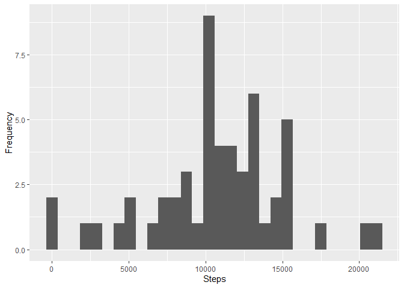
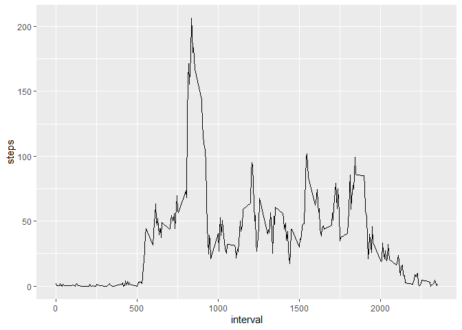
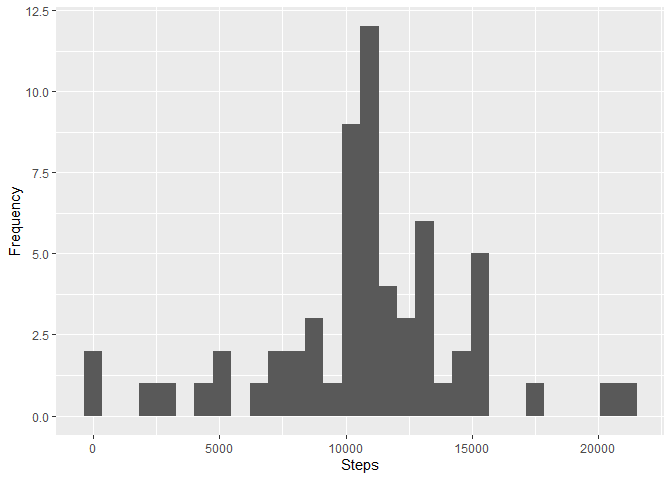
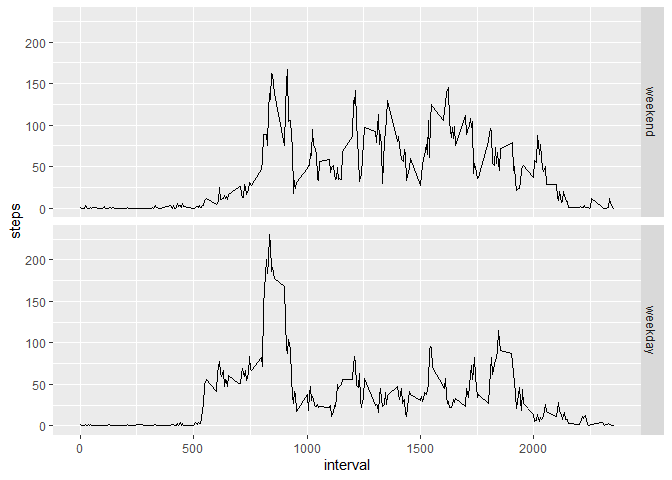

  
## Loading and preprocessing the data  
  
To load the data first we need to unzip data to get the csv file.


```r
unzip("activity.zip")
activity <- read.csv("activity.csv")
```

  
## What is mean total number of steps taken per day?  
  

- Clculating total number of steps taken per day


```r
activity$date <- as.Date(activity$date)
totalSteps <- aggregate(steps ~ date, data = activity, sum)
```

- Making histogram of the total number of steps taken each day


```r
library(ggplot2)
qplot(steps, data = totalSteps, xlab = "Steps", ylab = "Frequency")
```

<!-- -->


- Clculate **mean** and **median** of the total number of steps taken per day


```r
mean(totalSteps$steps)
```

```
## [1] 10766.19
```


```r
median(totalSteps$steps)
```

```
## [1] 10765
```
  
## What is the average daily activity pattern?
  

- calcualte the average number of steps per each 5-minute interval 


```r
avgInterval <- aggregate(steps~interval, data = activity, mean, na.rm = TRUE)
```

- plot time series of the 5-minute interval (x-axis) and the average number of steps taken, averaged across all days (y-axis)


```r
g <- ggplot(data = avgInterval, aes(x = interval, y = steps))
g + geom_line()
```

<!-- -->

- The 5-minute interval, on average across all the days in the dataset, contains the maximum number of steps


```r
maxsteps <- avgInterval[avgInterval$steps == max(avgInterval$steps),]
maxsteps$interval
```

```
## [1] 835
```

```r
maxsteps$steps
```

```
## [1] 206.1698
```


## Imputing missing values


- Calcualte the number of missing values in the dataset


```r
sum(is.na(activity$steps))
```

```
## [1] 2304
```


- Imputing missing value by mean steps for that 5-minute interval using `avgInterval` calculated perviously


```r
## creating to new data frame to fill missings in
activityFilled <- activity

for(i in 1:nrow(activity)){
    if(is.na(activity$steps[i])){
        activityFilled$steps[i] <- avgInterval$steps[avgInterval$interval == activityFilled$interval[i]]
    }
}

## see if there still any missings
sum(is.na(activityFilled$steps))
```

```
## [1] 0
```

- making histogram of total number of steps per day after imputing missing values


```r
totalStepsFilled <- aggregate(steps ~ date, data = activityFilled, sum)
qplot(steps, data = totalStepsFilled, xlab = "Steps", ylab = "Frequency")
```

<!-- -->

- Clculating **mean** and **median** values of imputed data


```r
mean(totalStepsFilled$steps)
```

```
## [1] 10766.19
```


```r
median(totalStepsFilled$steps)
```

```
## [1] 10766.19
```

- After imputing missing data with the mean of the data still the same and there's a very slight change in median value

Data|Mean|Median
---|---|---
Before Filling|10766.19|10765
After Filling|10766.19|10766.19


## Are there differences in activity patterns between weekdays and weekends?

- Create a new factor variable in the dataset with two levels - "weekday" and "weekend" indicating whether a given date is a weekday or weekend day


```r
activityFilled$days <- ifelse(weekdays(activityFilled$date) %in% c("Sunday", "Saturday"), "weekend", "weekday")
activityFilled$days <- factor(activityFilled$days, levels = c("weekend", "weekday"))
```

- Calculate average number of steps taken in each 5-minute interval, averaged across all weekday days or weekend days 


```r
avgInterDays <- aggregate(steps ~ interval + days, data = activityFilled, mean)
```

- Make a panel plot containing a time series plot of the 5-minute interval (x-axis) and the average number of steps taken, averaged across all weekday days or weekend days (y-axis)


```r
g <- ggplot(data = avgInterDays, aes(x = interval, y = steps))
g + geom_line()+
  facet_grid(days~.)
```

<!-- -->

